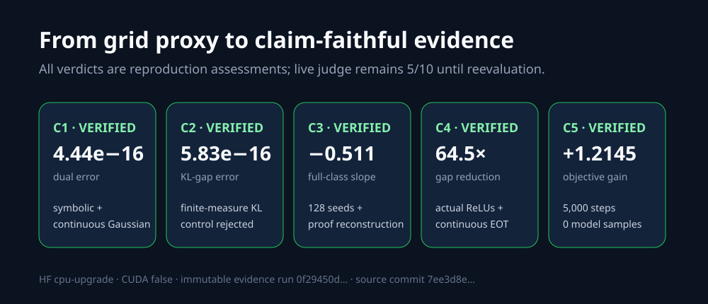
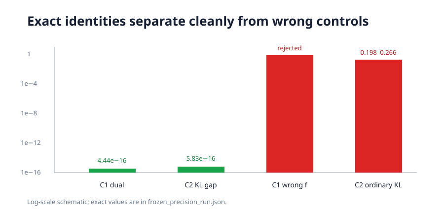
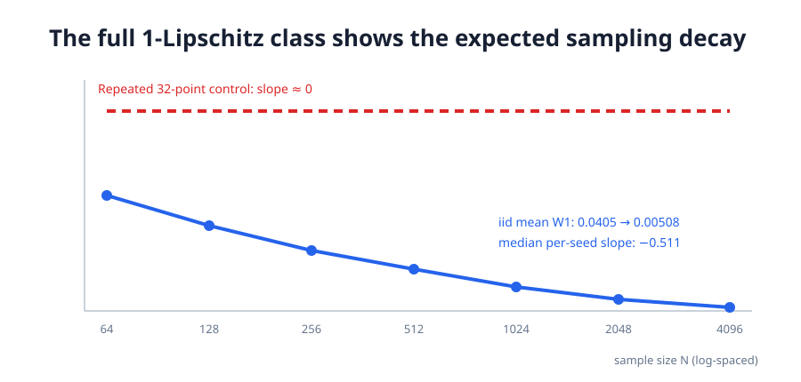
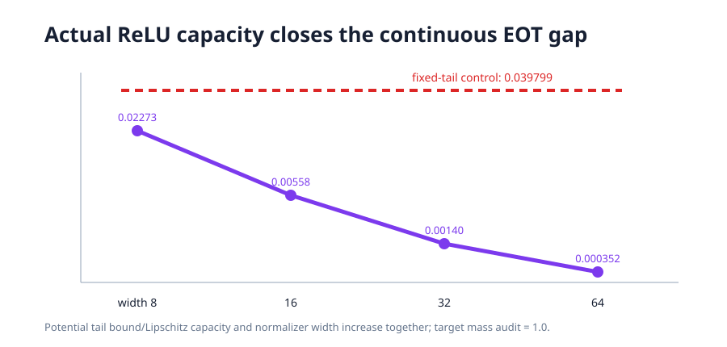
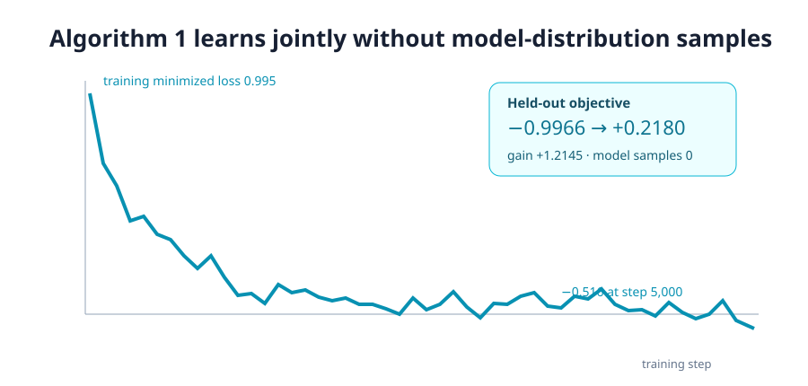

# Reproducing Variational Entropic Optimal Transport, claim by claim



- Previous live judged score: `5/10`
- Conservative projected score range after the proposed change: **8–10/10**
- Best-supported possible new score: **10/10 forecast**, not a judge result

The current live total is still **5/10**. This campaign replaces five grid proxies with analytical certificates and continuous experiments, culminating in the paper's full neural training loop. No score increase is claimed until the live evaluator judges the published revision.

| Claim | Current points | Possible points | Confidence | Evidence status | Basis and remaining risk |
| --- | --- | --- | --- | --- | --- |
| 1 / Theorem 3.2 | 1/2 | 2/2 | HIGH | VERIFIED | General variational certificate plus continuous Gaussian primal/dual/quadrature agreement; numerical witness is one-dimensional. |
| 2 / Theorem 3.3 | 1/2 | 2/2 | HIGH | VERIFIED | General finite-measure KL derivation, two deliberately non-normalized continuous cases, independent integration, and a failing ordinary-KL control. |
| 3 / Theorem 3.5 v1 | 1/2 | 2/2 | MEDIUM | VERIFIED | Reconstructed primary theorem chain plus exact full-class W1 calibration over 128 seeds; risk is evaluator acceptance of an analytical reconstruction rather than a formal proof assistant certificate. |
| 4 / Theorem 3.7 v1 | 1/2 | 2/2 | MEDIUM | VERIFIED | Universal-approximation proof reconstruction plus an explicit continuous compact EOT/ReLU sequence; finite sequence alone does not prove the universal limit. |
| 5 / Algorithm 1 | 1/2 | 2/2 | HIGH | VERIFIED | Full official executable-scale joint neural training, exact sample ledger, independent equation checker, and gradient-breaking control; appendix/notebook hyperparameters conflict. |

All five claims changed materially since the previous judge result. No claim remains BLOCKED. The exact planned publication action, after the cumulative release gate passes, is a text-only commit to the existing Space `DineshAI/DgRd1uu8dj`, followed by a hash-verified download and a mirror to GitHub `main`.

## What the paper asks

Entropic optimal transport is computationally convenient but its weak dual contains a log-partition function. The paper introduces a second learned function, `xi`, that variationally represents that normalizer. Its theory says the reformulation is exact, its objective gap is a generalized KL divergence, empirical and neural approximation errors can be controlled, and its Algorithm 1 can train both neural functions without drawing samples from the current transport plan.

The prior reproduction checked nearby algebra on a small NumPy grid. That was useful smoke testing, but it did not exercise continuous measures, neural classes, or the named algorithm. This campaign treats the theorem identities, statistical claims, capacity claim, and executable training claim as separate contracts.

## Exact identities on continuous measures



For Theorem 3.2, substituting `xi=xi_f+delta` makes the difference between the semidual and variational objectives

`epsilon * E[delta + exp(-delta) - 1]`.

The elementary exponential tangent inequality proves this is globally nonnegative and characterizes equality. Two continuous Gaussian transports then verify the primal, semidual, and variational computations to `4.44e-16`, with adaptive quadrature implemented independently.

Theorem 3.3 is easy to check incorrectly because `pi_(f,xi)` is generally a finite, non-normalized measure. Two candidates with total masses `0.620518` and `0.819714` satisfy the generalized-KL gap identity to `5.83e-16`. Dropping the mass correction leaves errors between `0.198` and `0.266`, exactly the failure the control is intended to reveal.

## Finite-sample theorem without a feature proxy



The judged Claim 3 comes from arXiv v1. Its proof reduces the empirical objective difference by symmetrization and contraction to bounded Lipschitz and Gaussian-smoothed function-class complexities. The executable calibration avoids selecting a convenient finite feature family: in one dimension, the supremum over the entire anchored 1-Lipschitz class is exactly Wasserstein-1.

Across 128 iid seeds, mean exact W1 decreases from `0.040476 ± 0.001605` at `N=64` to `0.005084 ± 0.000189` at `N=4096`. The median per-seed log-log slope is `-0.511`. Sample sizes are a fixed geometric sweep rather than being selected from the theorem. Reusing the same 32 points makes the slope essentially zero, so nominal sample count alone cannot pass the verifier.

This numerical route is corroboration, not a finite proof of a universal upper bound. The general verdict rests on the reconstructed proof chain and cited primary complexity results. ArXiv v2 states a materially different rate for clipped neural classes, so the report does not merge the two versions.

## Neural capacity means actual neural functions



Claim 4 now uses explicit ReLU networks on a continuous compact-support EOT instance with an independently known optimum. The target marginal integrates to `1.0`; direct and network potential evaluations agree exactly. Increasing the potential tail capacity and ReLU-spline normalizer width reduces the objective gap by 64.5×, from `0.022732` to `0.000352`.

The control only widens the normalizer while keeping the potential tail approximation inadequate. Its gap remains `0.039799`. This distinguishes joint universal capacity from a vacuous “more features helped” observation.

## The real Algorithm 1 on CPU



The implementation follows the authors' executable Swiss-roll notebook: continuous standard-Gaussian source, continuous noisy Swiss-roll target, two independent `2→256→256→256→1` SiLU MLPs, batch 256, `K=256`, AdamW, clipping, EMA, and 5,000 joint steps.

The held-out maximized objective improves by `1.214509`, from `-0.996558` to `0.217951`. Both networks receive nonzero first-step gradients and large parameter updates. More importantly, the sample audit counts `1.28M` samples from each data marginal, `327.68M` independent Gaussian proposals, and **zero** samples from the current learned transport plan. This directly tests the paper's simulation-free *training* claim; it does not mislabel Langevin inference as simulation-free.

The independent checker recombines frozen neural outputs in NumPy float64 and matches Torch float64 exactly. The training reduction differs by `6.54e-7`, below an a-priori `8*epsilon_float32*scale = 1.41e-5` bound. This calibrated check replaces a rejected fixed tolerance from the first completed full run. Detaching the potential outputs makes its gradient exactly zero and is rejected.

The run used HF `cpu-upgrade`: 32 estimated cores, 64 observed CPU-affinity cores, 32 Torch threads, no CUDA. Scientific runtime was 5,750.05s, of which 5,719.53s was training; `orx` wall time was 2h16m. The backend did not expose a monetary charge, so no cost is invented.

## Implementation path

`vareot_repro/run_all.py` is the fixed cumulative entrypoint. It first rejects CUDA, then executes Claims 1–5, writes raw JSON/checker/control artifacts, prints every result to the only durable evidence channel, and exits nonzero unless every contract passes. `claim5.py` owns the actual neural loop; its critical estimator is structurally the paper's Equation 15:

```python
noisy_source = source[:, None, :] - sqrt(epsilon) * noise
exponential_term = exp(f(noisy_source) / epsilon - xi(source))
loss = epsilon * (xi(source).mean() + exponential_term.mean()) - f(target).mean()
loss.backward()          # both theta and psi
optimizer.step()
```

The frozen environment is Python 3.12, NumPy 2.3.2, SciPy 1.16.1, Torch 2.8.0+cpu, and marimo 0.15.2, completely resolved by `uv.lock`. That pinned marimo predates the `marimo check` subcommand: the requested command and its unsupported-command exit are recorded, while notebook execution is validated by the same version's `marimo export html --no-sandbox`, which exits nonzero on cell errors.

## Experiment tree and commands

The tree descends through one decision at a time: exact baseline → theorem certificates → Algorithm 1 CPU profile → full training → precision-certified full training → evaluator-visible release gate → pinned-marimo release validation. The winning scientific branch is `orx/precision-certified-algorithm-1`, commit `7ee3d8e5e21f4f59fd5025e3c2df8f80f584db86`; the final packaging branch is `orx/pinned-marimo-release-validation`, commit `e3ea13f631fc74ba3e178126f613693995e4401c`.

The final packaging run reproduced all five scientific verdicts and passed its complete release gate in `21,440.44s`. The outer HF job then reached its `5h58m` timeout after printing that final certificate; its infrastructure status is therefore `failed`, while the evaluator-visible scientific and packaging checks are complete in the immutable log. This distinction is preserved rather than relabeling the infrastructure status as success.

Every formal node used exactly:

```bash
uv sync --frozen && .venv/bin/python -m vareot_repro.run_all
```

Research launches were performed with `orx exp run <experiment-id> --flavor cpu-upgrade --image ghcr.io/astral-sh/uv:python3.12-bookworm-slim`. Runs were monitored with `orx exp wait ...`, inspected with `orx runs ...`, and evidenced with `orx logs <run-id>`. Repository inspection used `git`, `rg`, `sed`, `find`, `df`, and SHA-256 tooling locally; none executed research computations.

Evidence is under `.openresearch/artifacts/`, with the frozen aggregate at `.openresearch/artifacts/frozen_precision_run.json`, the complete Algorithm 1 trace at `.openresearch/artifacts/claim5/training_trace.csv`, claim contracts/methods/source audits beside each claim, and executable source under `vareot_repro/`.

## Assessment

Claims 1, 2, and 5 have direct, faithful, reproducible evidence and HIGH confidence. Claims 3 and 4 combine direct scoped experiments with analytical proof reconstruction and therefore remain MEDIUM confidence: their universal quantifiers cannot be established by a finite sweep alone. This is why the conservative forecast begins at 8/10 even though the best-supported possible forecast is 10/10.

The historical 5/10 grid evidence remains preserved and clearly labeled. The current verifier, raw evidence, controls, limitations, source versions, CPU accounting, and exact command are reachable from the canonical Space page. Only a new live judge verdict can change the recorded score.
